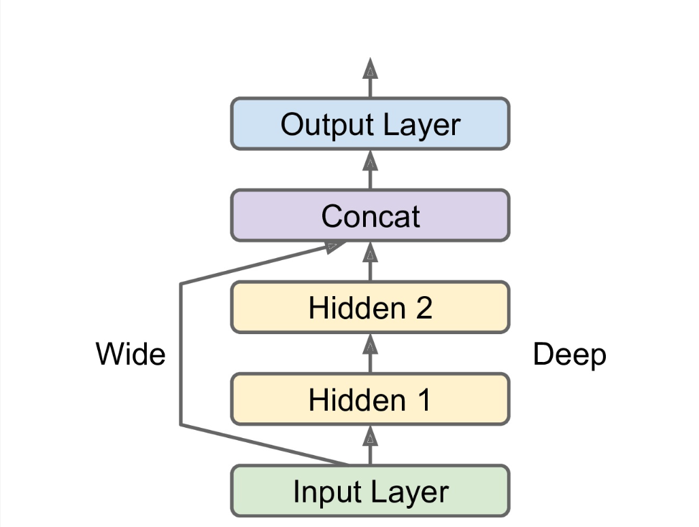
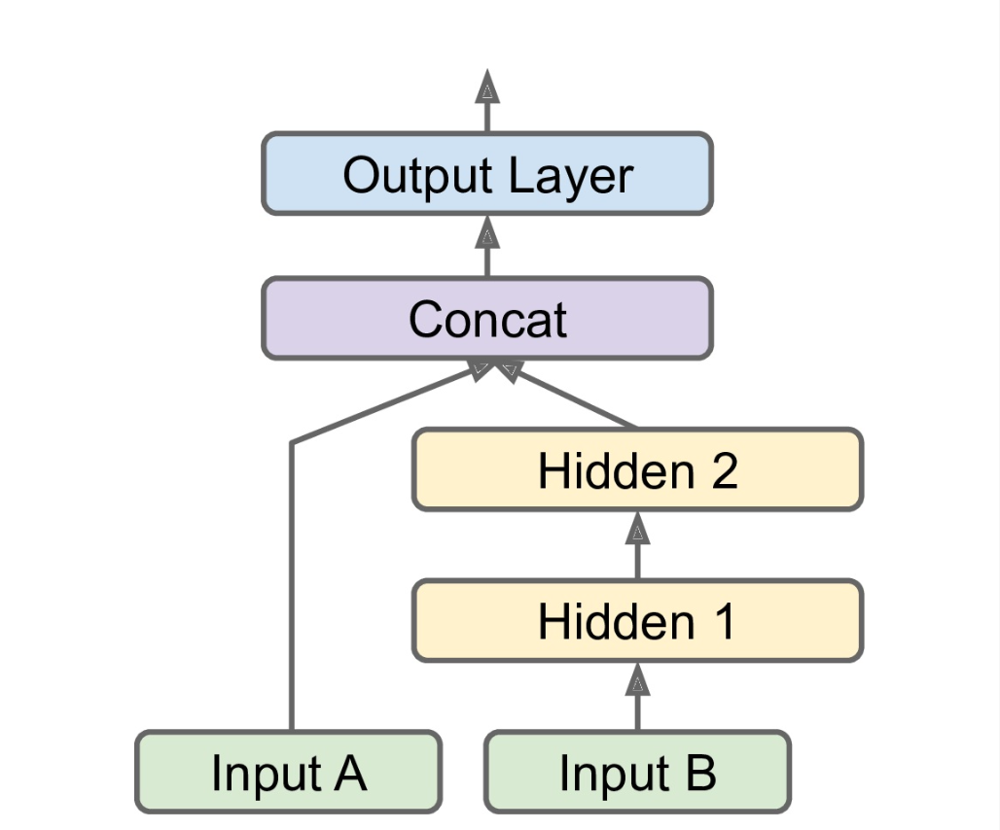
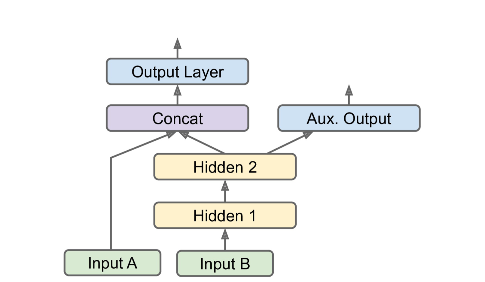

# Neural Networks and Deep Learning

    - Building and training with TensorFlow and Keras
    - Architectures: feedforward for tabular data, CNN for computer vision, RNN and LSTM for sequence processing
    - Encoder / decoder and Transformers for NLP
    - Autoencoders and generative Adversarial Network (GANs) for generative learning
    - Techniques for training DNN
    - Reinforcement learning - building agent to play a game
    - Loading and preprocessing large amount of data
    - Training and deploying at scale

## Contents
- Introduction to ANN with Keras
    - [Sequential API](#Sequential-API), classification & regression
    - [Functional API](#Functional-API)
    - Subclassing API for dynamic models
    - [Using Callbacks](#Using-Callbacks), EarlyStopping, ModelCheckpoints
    - [TensorBoard](#TensorBoard)
    - [Fine-Tuning Neural Network Hyperparameters](#Fine-Tuning-Neural-Network-Hyperparameters)

### Sequential API
```py
"""Classification MLP"""
# "sparse_categorical_crossentropy"    0 to 9 
#"categorical_crossentropy"          [0., 0., 0., 1., 0., 0., 0., 0., 0., 0.] 
# binary classification "sigmoid" (i.e., logistic) activation function in the output layer instead of the "softmax" activation function, and we would use the "binary_crossentropy" loss.

model.compile(loss="sparse_categorical_crossentropy",
                optimizer="sgd",
                metrics=["accuracy"])
history = model.fit(X_train, y_train, epochs=30,
                    validation_data=(X_valid, y_valid))
model.evaluate(X_test, y_test)
y_proba = model.predict(X_new)
y_pred = model.predict_classes(X_new)
# History
import pandas as pd
import matplotlib.pyplot as plt
pd.DataFrame(history.history).plot(figsize=(8, 5))
plt.grid(True)
plt.gca().set_ylim(0, 1) # set the vertical range to [0-1]
plt.show()
```
- If you want to convert sparse labels (i.e., class indices) to one-hot vector labels, use the `keras.utils.to_categorical()` function. To go the other way round, use the `np.argmax()` function with `axis=1`.

- You must **compile** the model, **train** it, **evaluate** it, and use it to **make predictions**.

- `.fit()` validation_split=0.1, class_weight, sample_weight

```py
"""Regression MLP"""
from sklearn.datasets import fetch_california_housing
from sklearn.model_selection import train_test_split
from sklearn.preprocessing import StandardScaler

housing = fetch_california_housing()
X_train_full, X_test, y_train_full, y_test = train_test_split(
    housing.data, housing.target)
X_train, X_valid, y_train, y_valid = train_test_split(
    X_train_full, y_train_full)

scaler = StandardScaler()
X_train = scaler.fit_transform(X_train)
X_valid = scaler.transform(X_valid)
X_test = scaler.transform(X_test)

model = keras.models.Sequential([
       keras.layers.Dense(30, activation="relu", input_shape=X_train.shape[1:]),
       keras.layers.Dense(1)
])

model.compile(loss="mean_squared_error", optimizer="sgd")
history = model.fit(X_train, y_train, epochs=20, validation_data=(X_valid, y_valid))
mse_test = model.evaluate(X_test, y_test)
X_new = X_test[:3] # pretend these are new instances
y_pred = model.predict(X_new)
```

### Functional API
- <br>
```py
input_ = keras.layers.Input(shape=X_train.shape[1:])
hidden1 = keras.layers.Dense(30, activation="relu")(input_)
hidden2 = keras.layers.Dense(30, activation="relu")(hidden1)
concat = keras.layers.Concatenate()([input_, hidden2])
output = keras.layers.Dense(1)(concat)
model = keras.Model(inputs=[input_], outputs=[output])
```
- <br>
```py
input_A = keras.layers.Input(shape=[5], name="wide_input")
input_B = keras.layers.Input(shape=[6], name="deep_input")
hidden1 = keras.layers.Dense(30, activation="relu")(input_B)
hidden2 = keras.layers.Dense(30, activation="relu")(hidden1)
concat = keras.layers.concatenate([input_A, hidden2])
output = keras.layers.Dense(1, name="output")(concat)
model = keras.Model(inputs=[input_A, input_B], outputs=[output])

# As we have two inputs, we must specify two input features in .fit() and so on
model.compile(loss="mse", optimizer=keras.optimizers.SGD(lr=1e-3))
X_train_A, X_train_B = X_train[:, :5], X_train[:, 2:]
X_valid_A, X_valid_B = X_valid[:, :5], X_valid[:, 2:]
X_test_A, X_test_B = X_test[:, :5], X_test[:, 2:]
X_new_A, X_new_B = X_test_A[:3], X_test_B[:3]

history = model.fit((X_train_A, X_train_B), y_train, epochs=20, validation_data=((X_valid_A, X_valid_B), y_valid))
mse_test = model.evaluate((X_test_A, X_test_B), y_test)
y_pred = model.predict((X_new_A, X_new_B))
```
- <br>
```py
[...] # Same as above, up to the main output layer
output = keras.layers.Dense(1, name="main_output")(concat)
aux_output = keras.layers.Dense(1, name="aux_output")(hidden2)
model = keras.Model(inputs=[input_A, input_B], outputs=[output, aux_output])

model.compile(loss=["mse", "mse"], loss_weights=[0.9, 0.1], optimizer="sgd")
history = model.fit(
       [X_train_A, X_train_B], [y_train, y_train], epochs=20,
       validation_data=([X_valid_A, X_valid_B], [y_valid, y_valid]))

total_loss, main_loss, aux_loss = model.evaluate(
       [X_test_A, X_test_B], [y_test, y_test])
y_pred_main, y_pred_aux = model.predict([X_new_A, X_new_B])
```

### Using Callbacks
```py
"""It will only save your model when its performance on the validation set is the best so far"""
checkpoint_cb = keras.callbacks.ModelCheckpoint("my_keras_model.h5", save_best_only=True)

history = model.fit(X_train, y_train, epochs=10,
                    validation_data=(X_valid, y_valid),
                    callbacks=[checkpoint_cb])
model = keras.models.load_model("my_keras_model.h5") # roll back to best model
```
```py
"""It will interrupt training when it measures no progress on the validation set for a number of epochs (defined by the patience argument)"""
early_stopping_cb = keras.callbacks.EarlyStopping(patience=10,
                                                     restore_best_weights=True)
history = model.fit(X_train, y_train, epochs=100,
                       validation_data=(X_valid, y_valid),
                       callbacks=[checkpoint_cb, early_stopping_cb])

```

### TensorBoard
```py
import os

root_logdir = os.path.join(os.curdir, "my_logs")

def get_run_logdir():
    import time
    run_id = time.strftime("run_%Y_%m_%d-%H_%M_%S")
    return os.path.join(root_logdir, run_id)

run_logdir = get_run_logdir() # e.g., './my_logs/run_2019_06_07-15_15_22'

[...] # Build and compile your model
tensorboard_cb = keras.callbacks.TensorBoard(run_logdir)
history = model.fit(X_train, y_train, epochs=30,
                       validation_data=(X_valid, y_valid),
                       callbacks=[tensorboard_cb])

```

### Fine-Tuning Neural Network Hyperparameters
```py
def build_model(n_hidden=1, n_neurons=30, learning_rate=3e-3, input_shape=[8]):
    model = keras.models.Sequential()
    model.add(keras.layers.InputLayer(input_shape=input_shape))
    for layer in range(n_hidden):
        model.add(keras.layers.Dense(n_neurons, activation="relu"))
    model.add(keras.layers.Dense(1))
    optimizer = keras.optimizers.SGD(lr=learning_rate)
    model.compile(loss="mse", optimizer=optimizer)
    return model

# We need to create Scikit Regressor object
keras_reg = keras.wrappers.scikit_learn.KerasRegressor(build_model)

keras_reg.fit(X_train, y_train, epochs=100,
                 validation_data=(X_valid, y_valid),
                 callbacks=[keras.callbacks.EarlyStopping(patience=10)])

mse_test = keras_reg.score(X_test, y_test)
y_pred = keras_reg.predict(X_new)

from scipy.stats import reciprocal
from sklearn.model_selection import RandomizedSearchCV

param_distribs = {
       "n_hidden": [0, 1, 2, 3],
       "n_neurons": np.arange(1, 100),
       "learning_rate": reciprocal(3e-4, 3e-2),
}
rnd_search_cv = RandomizedSearchCV(keras_reg, param_distribs, n_iter=10, cv=3)
rnd_search_cv.fit(X_train, y_train, epochs=100,
                    validation_data=(X_valid, y_valid),
                    callbacks=[keras.callbacks.EarlyStopping(patience=10)])

rnd_search_cv.best_params_
rnd_search_cv.best_score_

model = rnd_search_cv.best_estimator_.model
```
