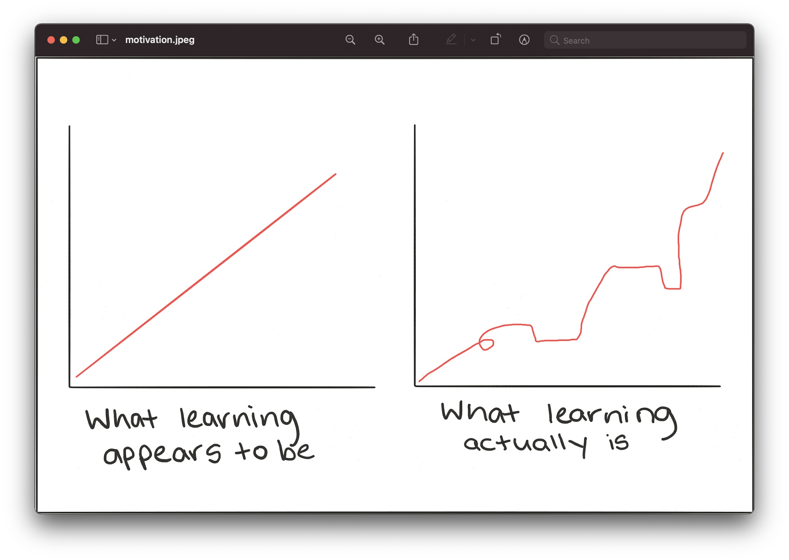

# Machine Learning Area

[Rustam-Z🚀](https://t.me/rz_zokirov) • [Find more here](https://t.me/rz_zokirov_ml)

> The goal is not to learn machine learning, but to learn how to create software using Machine Learning models. The goal is to solve problems and help society with the help of AI. 

## Why should you learn Machine Learning?
I found two good answers on why you should care. Firstly, Machine Learning (ML) is making computers do things that we’ve never made computers do before. If you want to do something new, not just new to you, but to the world, you can do it with ML.

Secondly, if you don’t influence the world, the world will influence you.

If you focus on results, you will never change. 
If you focus on change, you will get results.

## How to study? 
- **First, learn to learn.**
- https://towardsdatascience.com/thinking-of-self-studying-machine-learning-remind-yourself-of-these-6-things-b55a5f2b6c7d
- https://elitedatascience.com/learn-machine-learning
- TensorFlow team Machine Learning roadmap, https://www.tensorflow.org/resources/learn-ml/basics-of-machine-learning
- Target learning Data Science using Krish Naik playlists, https://www.youtube.com/watch?v=mO8xck5cuTA

### 1% better every day = 3700% better at the end of the year
>> (1+1/100)**365 37.78343433288728">

## Roadmap
- **Math (Calculus, Linear Algebra, Propability & Statistics)** 
  - [Calculus](https://www.youtube.com/playlist?list=PLmdFyQYShrjd4Qn42rcBeFvF6Qs-b6e-L), *Don't Memorize*
  - [Caclulus](https://youtube.com/playlist?list=PLZHQObOWTQDMsr9K-rj53DwVRMYO3t5Yr), *3Blue1Brown*
  - [Linear Algebra](https://youtube.com/playlist?list=PLZHQObOWTQDPD3MizzM2xVFitgF8hE_ab), *3Blue1Brown*
  - [Statistics & Probability](https://www.khanacademy.org/math/statistics-probability)
- **Python**  
    - [My Python learning roadmap](https://github.com/Rustam-Z/learning-area#1-start-learning-python)
    - [NumPy](https://www.w3schools.com/python/numpy/default.asp), [Pandas](https://www.w3schools.com/python/pandas/default.asp), [Matplotlib](https://www.w3schools.com/python/matplotlib_intro.asp) 
    - [10 minutes to Pandas](https://pandas.pydata.org/pandas-docs/stable/user_guide/10min.html)
- **Machine Learning**
    - "Deep learning with Python", book, only first part
    - Machine Learning Course, Andrew Ng, coursera.org
    - Scikit-Learn
- **Deep Learning**
    - TensorFlow Developer Specialization, deeplearning.ai, coursera.org
    - "AI and Machine Learning for Coders", book
    - "Deep learning with Python", book, second part
    - "Hands-on Machine Learning with Scikit-Learn, Keras & TensorFlow", book
    - **fast.ai**

        **Advanced**
    - Deep learning MIT press, book
    - Deep Learning Specialization, Andrew Ng, coursera.org
    - TensorFlow Advanced Techniques, coursera.org
    - [Advanced Machine Learning Specialization](https://www.coursera.org/specializations/aml)
- **Data Science**
    - "Python for Data Analysis: Data Wrangling with Pandas, NumPy, and IPython", book
    - "Python Data Science Handbook", book

## Small steps everyday! 
Please, consider this repository for contributing too! 

<!-- 
## Path to FAANG! 
First, need to gain basic knowledge in Data Science and Machine learning:
    - Follow my roadmap (ML, DL, DS, TF (Hands-on))
    - Course, practice, books
    - Kaggle

Then, move to FAANG preperation (#algorithms, #systems_design and #behavior):
    - Cracking the coding interview, LeetCode
    - https://github.com/jwasham/coding-interview-university

    - Nodir's advice https://t.me/rz_zokirov_swe/285
    - Smns advice https://t.me/FaangInterviewChannel/58

    - https://t.me/faang_materials
    - https://t.me/FaangInterviewChannel

Хорошая мастер программа и стажировка по нужной теме + хорошая подготовка может принести офер джуниора в амазон.
-->