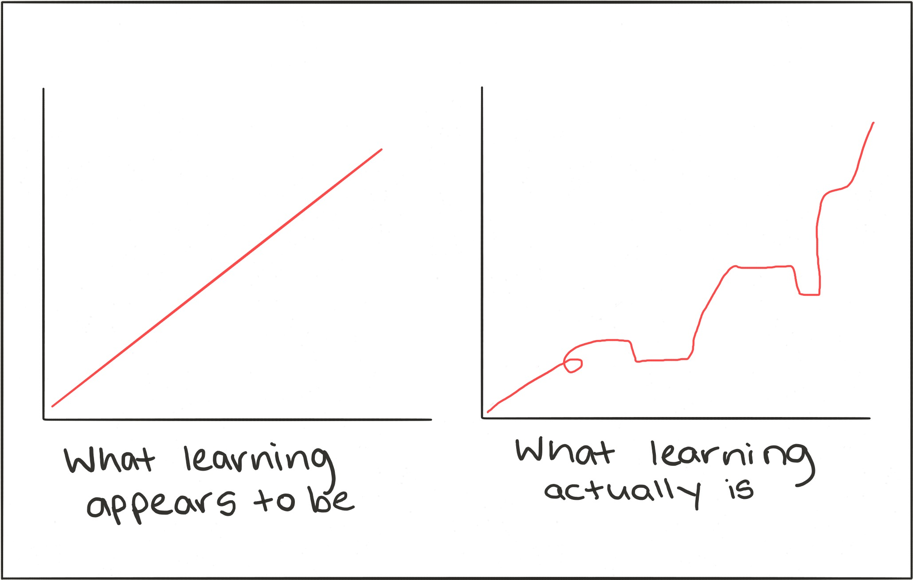

# Machine Learning Area
Hi everyone, I am Rustam, these days I feel like I need to brush up on my knowledge of ML & DL, so I decided to build a kind of roadmap for mastering ML from the very beginning. We will cover all the basic theory, then move to the processing for applying the gained knowlendge to create AI products.

> The goal is not learning Machine Learning, the goal is to learn how to build software with ML models. The goal is to become a machine learning problem solver, learn how to apply machine learning solutions, optimize for your own cases and environment, and solve real life problems.

I have a telegram channel, where I post all interesting stuff about AI. (https://t.me/rz_zokirov_ml)

## Why Should You Use Machine Learning?
I found two good answers on why you should care. Firstly, Machine Learning (ML) is making computers do things that we’ve never made computers do before. If you want to do something new, not just new to you, but to the world, you can do it with ML.

Secondly, if you don’t influence the world, the world will influence you.

## 1% better every day = 3700% better at the end of the year
>> (1+1/100)**365 37.78343433288728" style="width: 100%">

## How to study?
- https://towardsdatascience.com/thinking-of-self-studying-machine-learning-remind-yourself-of-these-6-things-b55a5f2b6c7d
- https://elitedatascience.com/learn-machine-learning
- TensorFlow team Machine Learning roadmap, https://www.tensorflow.org/resources/learn-ml/basics-of-machine-learning
- Target learning Data Science using Krish Naik playklists, https://www.youtube.com/watch?v=mO8xck5cuTA

## Draft Roadmap
- Math (Calculus, Linear Algebra, Propability & Statistics) 
  - Calculus, Don't Memorize, https://www.youtube.com/playlist?list=PLmdFyQYShrjd4Qn42rcBeFvF6Qs-b6e-L
  - Caclulus, 3Blue1Brown, https://youtube.com/playlist?list=PLZHQObOWTQDMsr9K-rj53DwVRMYO3t5Yr
  - Linear Algebra, 3Blue1Brown, https://youtube.com/playlist?list=PLZHQObOWTQDPD3MizzM2xVFitgF8hE_ab
- Machine Learning
    - "Deep learning with Python", book, only first part
    - "AI and Machine Learning for Coders", book
    - Machine Learning Course, Andrew Ng, coursera.org
- Deep Learning
    - TensorFlow Developer Specialization, deeplearning.ai, coursera.org
    - "Deep learning with Python",    book, finish it
    - "Hands-on Machine Learning with Scikit-Learn, Keras & TensorFlow", book
    - **Advanced**
    - Deep learning MIT press, book
    - Deep Learning Specialization, Andrew Ng, coursera.org
    - TensorFlow Advanced Techniques, coursera.org
- Data Science
    - "Python for Data Analysis: Data Wrangling with Pandas, NumPy, and IPython", book
    - "Python Data Science Handbook", book
    - Big Data
    - Numpy, Pandas, Matplotlib

## Will be be updated soon, in progress...
Please, consider this repository for contributing too! 
