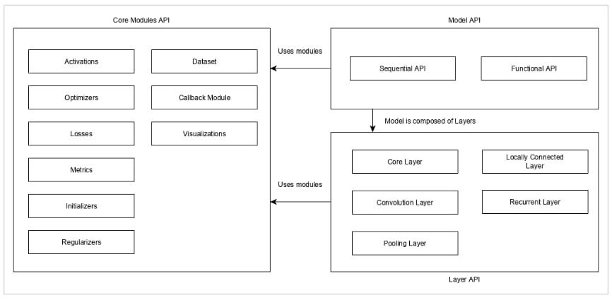
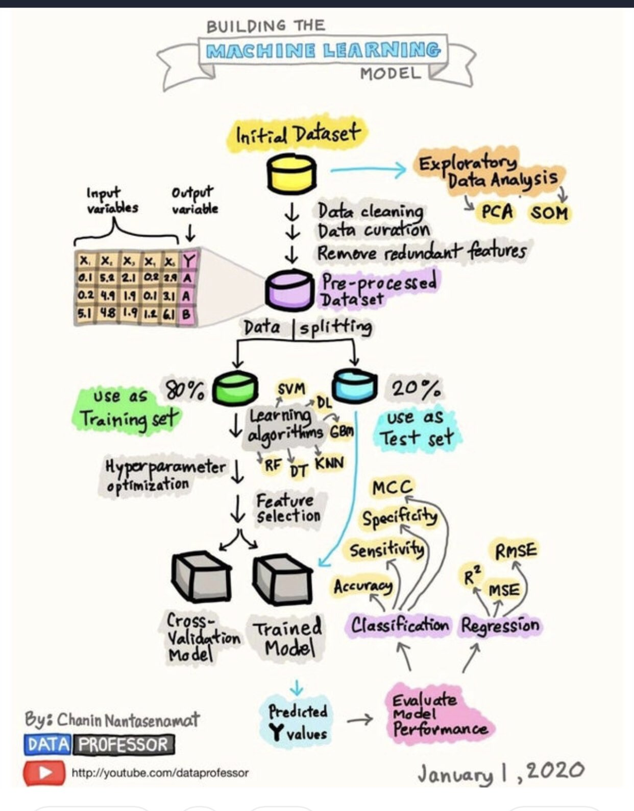
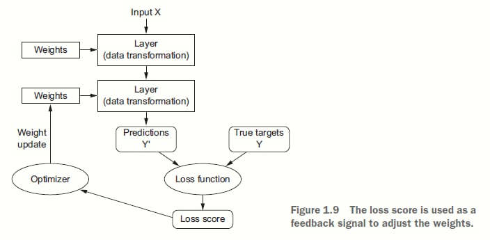
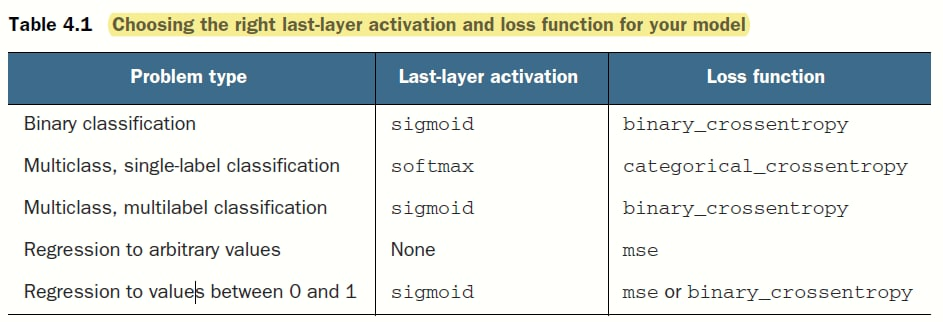
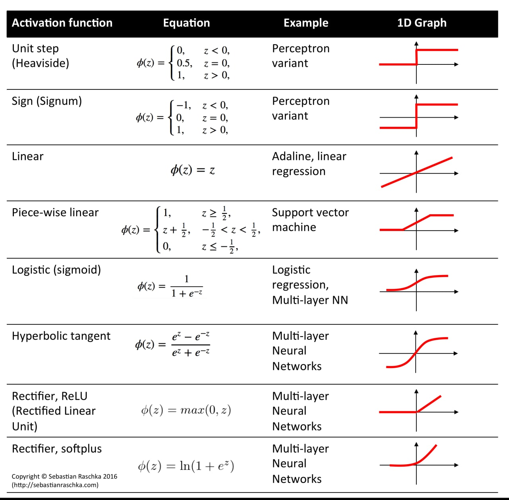
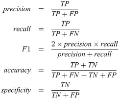

# Deep Learning with Python

## Keras API


## ML process
<br>
<br>

So, to do machine learning, we need three things:
1. **Input data points**—For instance, if the task is speech recognition, these data points could be sound files of people speaking. If the task is image tagging,
they could be pictures.
2. **Examples of the expected output**—In a speech-recognition task, these could be
human-generated transcripts of sound files. In an image task, expected outputs
could be tags such as “dog,” “cat,” and so on.
3. **A way to measure whether the algorithm is doing a good job**—This is necessary in order to determine the distance between the algorithm’s current output and its expected output. The measurement is used as a feedback signal to adjust the way the algorithm works. This adjustment step is what we call learning.

So that’s what machine learning is, technically: *searching for useful representations of some input data, within a predefined space of possibilities, using guidance
from a feedback signal.* This simple idea allows for solving a remarkably broad range of intellectual tasks, from speech recognition to autonomous car driving.

Machine learning is about mapping inputs (such as
images) to targets (such as the label “cat”), which is done by observing many examples of input and targets.

## Three important things
To make the network ready for training, we need to pick three more things, as part of the compilation step:
- The weights are modified using a function called **Optimization Function**. The **Loss function** is used to calculate the error of difference between the actual output and predicted output. (https://medium.com/data-science-group-iitr/loss-functions-and-optimization-algorithms-demystified-bb92daff331c 
- **A loss function**—How the network will be able to measure its performance on the training data, and thus how it will be able to steer itself in the right direction.
- **An optimizer**—The mechanism through which the network will update itself based on the data it sees and its loss function.
- **Metrics** to monitor during training and testing—Here, we’ll only care about accuracy (the fraction of the images that were correctly classified).

## Loss function and activation function 


## Activation functions


## Metrics
<br>
- https://towardsdatascience.com/20-popular-machine-learning-metrics-part-1-classification-regression-evaluation-metrics-1ca3e282a2ce
- https://towardsdatascience.com/20-popular-machine-learning-metrics-part-2-ranking-statistical-metrics-22c3e5a937b6

## Keras workflow
1. Define your training data: input tensors and target tensors.
2. Define a network of layers (or model ) that maps your inputs to your targets.
3. Configure the learning process by choosing a loss function, an optimizer, and
some metrics to monitor.
4. Iterate on your training data by calling the fit() method of your model.

## Optimization vs generalization
**Optimization** refers to the process of adjusting a model to get the best performance possible on the training data (the learning in machine learning), whereas **generalization** refers to how well the trained model performs on data it has never seen before.

> Always keep this in mind: deep learning models tend to be good at fitting to the training data, but the real challenge is generalization, not fitting.

## Model API
```python
from keras import models
from keras import layers

model = models.Sequential()
model.add(layers.Dense(32, activation='relu', input_shape=(784,)))
model.add(layers.Dense(10, activation='softmax'))

# And here’s the same defined using the functional API:

input_tensor = layers.Input(shape=(784,))
x = layers.Dense(32, activation='relu')(input_tensor)
output_tensor = layers.Dense(10, activation='softmax')(x)
model = models.Model(inputs=input_tensor, outputs=output_tensor)
```