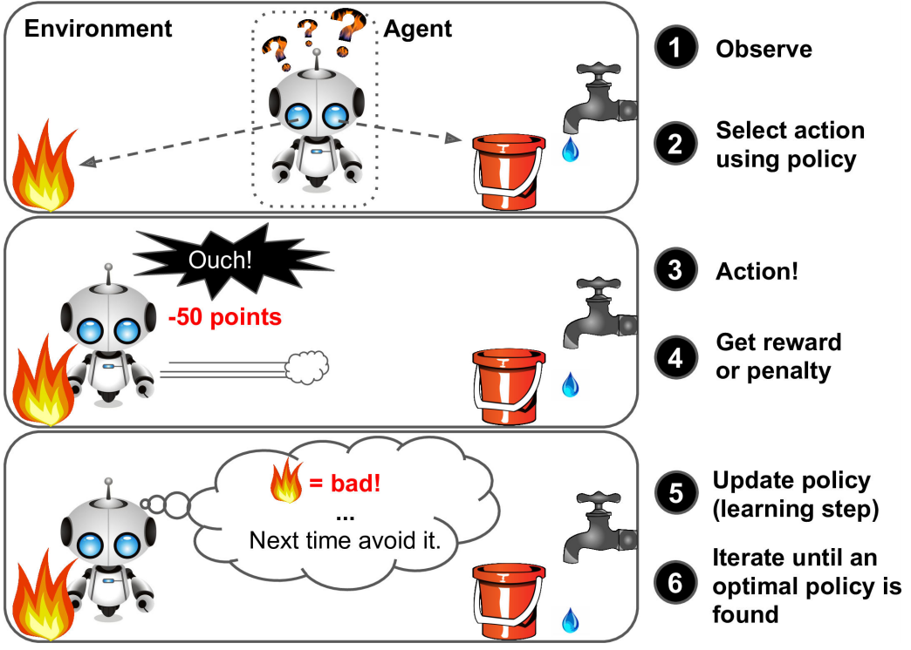

## CHAPTER 1: The Machine Learning Landscape
### What is Machine Learning?
- Machine learning (ML) is field of study that gives computers the ability to learn without being explicitly programmed.
- A computer program is said to learn from *experience E* with respect to some *task T* and some *performance measure P*, if its performance on T, as measured by P, improves with experience E.
- **Example:** T = flag spam for new emails, E = the training data, P = accuracy, the ratio of correctly classified emails.

### Why use ML?
- Problems for which existing solutions require a lot of hand-tuning or long lists of
rules: one Machine Learning algorithm can often simplify code and perform bet‐
ter. (spam classifier)
- Complex problems for which there is no good solution at all using a traditional
approach: the best Machine Learning techniques can find a solution. (speech recognition)
- Fluctuating environments: a Machine Learning system can adapt to new data.
- Getting insights about complex problems and large amounts of data. (data mining)

### Types of ML Systems
- Whether or not they are trained with human supervision `supervised, unsupervised, semisupervised, and Reinforcement Learning`
- Whether or not they can learn incrementally on the fly `online vs batch learning`
- Whether they work by simply comparing new data points to known data points, or instead detect patterns in the training data and build a predictive model, much like scientists do `instance-based vs model-based learning`

- **Supervised learning** - training data with labels (expected outputs). 
    - Tasks: classification, regression (univariate / multivariate). 
    - Class / sample / label / feature (predictors: age, brand, ...) / attribute
    - **Algorithms**
        - k-Nearest Neighbors
        - Linear Regression
        - Logistic Regression
        - Support Vector Machines (SVMs)
        - Decision Trees and Random Forests
        - Neural networks

- **Unsupervised learning** - training data is unlabeled.
    - Tasks: clustering, anomaly detection, visualization & dimensionality reduction. 
    - Clustering (find similar visitors)
        - K-Means
        - DBSCAN
        - Hierarchical Cluster Analysis (HCA)
    - Anomaly detection & novelty detection (detect unusual things)
        - One-class SVM
        - Isolation Forest
    - Visualization and dimensionality reduction (king of feature extraction)
        - Principal Component Analysis (PCA)
        - Kernel PCA
        - Locally-Linear Embedding (LLE)
        - t-distributed Stochastic Neighbor Embedding (t-SNE)
    - Association rule learning
        - Apriori
        - Eclat

    - `TIP!` Use dimensionality reduction algo before feeding to supervised learning algorithm.
    - `TIP!` Automatically removing outliers from a dataset before feeding it to another learning algorithm.

- **Semisupervised learning** - a lot of unlabeled data and a little bit of labeled data. 
    - Example: like in Google photos, it recongnizes same person in many pictures. We need supervised part because we need to seperate similar clusters. (like similar people)

- **Reinforcement Learning** - *agent* can observe environment, and perform some actions, and get *rewards* and *penalties*. Then it must teach itself the best strategy (*policy*) to get max reward. A policy defines what action the agent should choose when it is in a given situation.
 

- **Batch learning** - or *offline learning*, when you have new type of data, you need to retrain over whole dataset every time.
- **Online learning** - you train the system incrementally on a new data or mini-batch of data. 
    - You must set *learning rate* parameter, if you set hugh rate, then your system rapidly adapt to new data, but it will tend to forget the old data. 
    - A big challenge if bad data is fed to the system, the system’s performance will gradually decline. 
    - `TIP!` Monitor your latest input data using an anomaly detection algorithm.

- **Instance-based learning** - the system learns the examples by heart, then generalizes to new cases by comparing them to the learned examples using a *similarity measure*.
- **Model-based learning** - build the model, then use it to make *predictions*.

### Main Challenges of ML
- “Bad algorithm” and “bad data”
- **Bad data**
- If some instances are missing a few features (e.g., 5% of your customers did not specify their age), you must decide whether you want to ignore this attribute altogether, ignore these instances, fill in the missing values (e.g., with the median age), or train one model with the feature and one model without it, and so on.
- **Feature engineering**, involves:
    - *Feature selection*: selecting the most useful features to train on among existing features.
    - *Feature extraction*: combining existing features to produce a more useful one (dimensionality reduction algorithms can help).
    - Creating new features by gathering new data.

- **Bad algorithm**
    - **Overfitting** means that the model performs well on the training data, but it does not generalize well. How to overcome?
        - To simplify the model by selecting one with fewer parameters (a linear model rather than a high-degree polynomial model), by redusing number features in training data or or by constraining the model (with regularization).
        - To gather more training data.
        - To reduce the noise in the training data (fix data errors and remove outliers).
    - **Underfitting** occurs when your model is too simple to learn the underlying structure of the data. The options to fix:
        - Selecting a more powerful model, with more parameters.
        - Feeding better features to the learning algorithm (feature engineering)
        - Reducing the constraints on the model (reducing the regularization hyperparameter)

- The system will not perform well if your training set is too small, or if the data is not representative (production level data), noisy, or polluted with irrelevant features (garbage in, garbage out). Lastly, your model needs to be neither too simple.

### Testing and Validating
- 80% training and 20% testing. If 10 million samples 1% for testing is enough.
- **Hyperparameter Tuning and Model Selection** `page 32`
    - Example: you are hesiteting between two models linear and polinomial. You must try both and see which one is generalizing better on test set. You want to apply regularization to decrease overfitting, so you don't know how to choose a hyperparameter. Try 100 different hyperparameters, and find the best which produces small error.
    - However, after you deployed your model you see 15% error. It is probably because you chose *hp* for this particular set. Then you should use **holdout validation "with validation / dev set"**. You train multiple models with various hyperparameters on the reduced training set (training - validation set). Select model performing best on val-on set. And train again on full dataset. 
    - [**Cross validation**](https://machinelearningmastery.com/repeated-k-fold-cross-validation-with-python/)
- **Data Mismatch** `page 33`
    - Example: You want to developer flowers species classifier. You downloaded pictures from web. And you have 10K pictures taken with the app. **TIP! Remember, your validation and test set must be as representitive as possible you expect to use in production.** In this case divide 50 / 50 to dev & test sets (pics must not be duplicated in both, even near-duplicate). 
    - After training you see that model on validation set is very poor. Is it overfitting or mismatch between web and phone pics?
    - One solution, is to take the part of training (web pics) into **train-dev set**. After training a model, you see that model on train-dev set is good. Then the problem is data mismatch. Use preprocessing, and make web pics look like phone pics. 
    - But if model is bad on train-dev set, then you have overfitting. You should try to simplify or regularize the model, get more training data and clean up the training data.
    
### Extra 
- **Hyper-parameters** are those which we supply to the model, for example: number of hidden Nodes and Layers, input features, Learning Rate, Activation Function etc in Neural Network, while **Parameters** are those which would be learnt during training by the machine like Weights and Biases.

