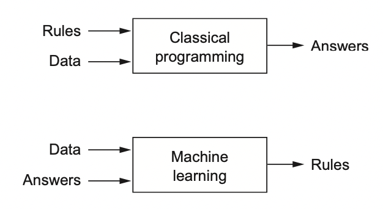

# [Introduction to TensorFlow for Artificial Intelligence, Machine Learning, and Deep Learning](https://www.coursera.org/learn/introduction-tensorflow/home/welcome)

## Contents:
- Week 1 - A new programming paradigm
- Week 2 - Intro to CV
- Week 3 - CNN
- Week 4 - Using real-world images
 
> `!pip install tensorflow==2.0.0-alpha0` run it to use TensorFlow 2.x in Google Colab
> https://drive.google.com/drive/folders/1R4bIjns1qRcTNkltbO9NOi7jgnrM-VLg?usp=sharing The notebooks you can work with

## A new programming paradigm
### A primer in machine learning


### The ‘Hello World’ of neural networks
```python
from keras import models
from keras import layers
import numpy as np

model = keras.Sequential([keras.layers.Dense(units=1, input_shape=[1])])
model.compile(optimizer='sgd', loss='mean_squared_error') # Guess the pattern and measure how badly or good the algorithm works

# Just imagine you have lots of Xs and Ys, the computer doesn't know the correlation between them. Your algorithm tries to connect Xs to Ys (makes guesses). The loss functions looks at the predicted outputs and actial outputs and *measures how good or badly the guess was. Then it gives its value to optimizer which figures out the next guess (update its parameters). So the optimizer thinks about how good or how badly the guess was done using the data from the loss function.

xs = np.array([-1.0, 0.0, 1.0, 2.0, 3.0, 4.0], dtype=float)
ys = np.array([-3.0, -1.0, 1.0, 3.0, 5.0, 7.0], dtype=float)

model.fit(xs, ys, epochs=500) # Training

print(model.predict([10.0])) # You can expect 19 because y = 2x - 1, but it will be very close to ≈19
```

## Introduction to Computer Vision
> https://github.com/zalandoresearch/fashion-mnist 70K images

```python
import tensorflow as tf
import numpy as np
import matplotlib.pyplot as plt # plt.imshow(training_images[0])
print(tf.__version__)

# Loading the dataset
mnist = tf.keras.datasets.fashion_mnist
(training_images, training_labels), (test_images, test_labels) = mnist.load_data()
print(training_images.shape)
print(test_images.shape)

# Normalizing
training_images  = training_images / 255.0
test_images = test_images / 255.0

# Building the model
model = tf.keras.models.Sequential([tf.keras.layers.Flatten(), 
                                    tf.keras.layers.Dense(128, activation=tf.nn.relu), 
                                    tf.keras.layers.Dense(10, activation=tf.nn.softmax)])

# Defining the model
model.compile(optimizer=tf.optimizers.Adam(),
              loss='sparse_categorical_crossentropy',
              metrics=['accuracy'])

# Training the model, i.e. fitting training data to training labels
model.fit(training_images, training_labels, epochs=5)

model.evaluate(test_images, test_labels)

```
- Notes:
    - **Sequential**: That defines a SEQUENCE of layers in the neural network
    - **Flatten**: Flatten just takes the input and turns it into a 1 dimensional set. Via ROWS 
    - **Dense**: Adds a layer of neuron. Each layer of neurons need an 'activation function' to tell them what to do. There's lots of options, but just use these for now.
    - **Relu** effectively means "If X>0 return X, else return 0" -- so what it does it it only passes values 0 or greater to the next layer in the network.
    - **Softmax** takes a set of values, and effectively picks the biggest one, so, for example, if the output of the last layer looks like [0.1, 0.1, 0.05, 0.1, 9.5, 0.1, 0.05, 0.05, 0.05], it saves you from fishing through it looking for the biggest value, and turns it into [0,0,0,0,1,0,0,0,0] -- The goal is to save a lot of coding!
    - https://stackoverflow.com/questions/44176982/how-does-the-flatten-layer-work-in-keras

```python
# What if you want to stop training when you reached the accuracy neededO
import tensorflow as tf

mnist = tf.keras.datasets.fashion_mnist

(x_train, y_train),(x_test, y_test) = mnist.load_data()
x_train, x_test = x_train / 255.0, x_test / 255.0

callbacks = myCallback() # 

model = tf.keras.models.Sequential([
  tf.keras.layers.Flatten(input_shape=(28, 28)),
  tf.keras.layers.Dense(512, activation=tf.nn.relu),
  tf.keras.layers.Dense(10, activation=tf.nn.softmax)
])
model.compile(optimizer=tf.optimizers.Adam(),
              loss='sparse_categorical_crossentropy',
              metrics=['accuracy'])

model.fit(x_train, y_train, epochs=10, callbacks=[callbacks]) # You need to add callbacks argument
```