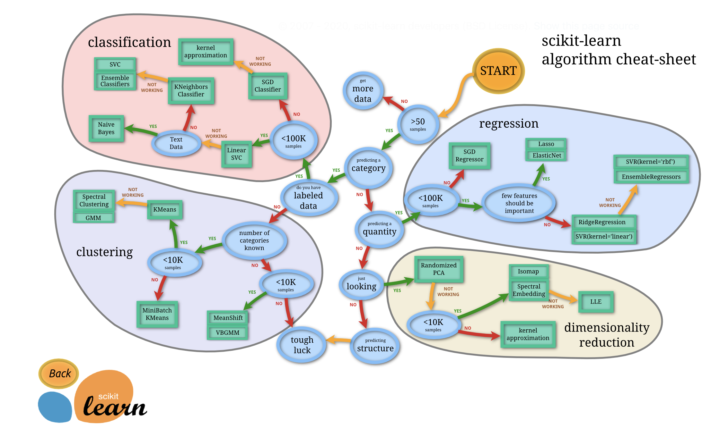

# Scikit-Learn



- [freeCodeCamp.org](https://youtu.be/pqNCD_5r0IU)

### How to save / upload model
```py
import joblib

model = joblib.load('model.sav') # Load the model
joblib.dump(model, 'model.sav') # Save the model
```

### K-Nearest Neighbors (KNN) 
> [Notebook](knn.ipynb)
- Measured with Euclidean or Manhattan [distance](https://www.analyticsvidhya.com/blog/2020/02/4-types-of-distance-metrics-in-machine-learning/)
- For **KNN regressor** you take the average of `n_neighbors=23` nearest neighbours
- For **KNN classifier** you take the mood of `n_neighbors=23` nearest neighbours

### SVM
> [Notebook](svm.ipynb)
- `support vectors`, `hyperplane`, `margin`, `linear seperable`, `non-linear seperable`
- Our goal is to **maximize** the **margin** (distance between marginal hyperplanes)
- **SVM kernels** - transforms from low-dimension to high-dimension

### K-Means Clustering
1. Select **K** value - centroid
2. Initialize centroids randomly
3. Calculate **Euclidean distance** between two points
4. Select the group and find the **mean**
5. Move controid to that mean

- How to select **K**?
    - Elbow method, K=1 to 20