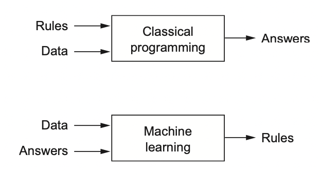

# [Introduction to TensorFlow for Artificial Intelligence, Machine Learning, and Deep Learning](https://www.coursera.org/learn/introduction-tensorflow/home/welcome)

## Contents:
- Week 1 - [A new programming paradigm](#A-new-programming-paradigm)
- Week 2 - [Introduction to Computer Vision](#Introduction-to-Computer-Vision)
- Week 3 - [Convolutional Neural Networks](#Convolutional-Neural-Networks)
- Week 4 - [Using real-world images](#Using-Real-world-Images)
 
> `!pip install tensorflow==2.0.0-alpha0` run it to use TensorFlow 2.x in Google Colab

> The notebooks you can work with: https://drive.google.com/drive/folders/1R4bIjns1qRcTNkltbO9NOi7jgnrM-VLg?usp=sharing 

## A new programming paradigm
> [Notebook](notebooks/Course_1_Part_2_Lesson_2_Notebook.ipynb) 

### A primer in machine learning


### The ‘Hello World’ of neural networks
```python
from keras import models
from keras import layers
import numpy as np

model = keras.Sequential([keras.layers.Dense(units=1, input_shape=[1])])
model.compile(optimizer='sgd', loss='mean_squared_error') # Guess the pattern and measure how badly or good the algorithm works

# Just imagine you have lots of Xs and Ys, the computer doesn't know the correlation between them. Your algorithm tries to connect Xs to Ys (makes guesses). The loss functions looks at the predicted outputs and actial outputs and *measures how good or badly the guess was. Then it gives its value to optimizer which figures out the next guess (update its parameters). So the optimizer thinks about how good or how badly the guess was done using the data from the loss function.

xs = np.array([-1.0, 0.0, 1.0, 2.0, 3.0, 4.0], dtype=float)
ys = np.array([-3.0, -1.0, 1.0, 3.0, 5.0, 7.0], dtype=float)

model.fit(xs, ys, epochs=500) # Training

print(model.predict([10.0])) # You can expect 19 because y = 2x - 1, but it will be very close to ≈19
```

## Introduction to Computer Vision
> [Notebook](notebooks/Course_1_Part_4_Lesson_2_Notebook.ipynb)

> https://github.com/zalandoresearch/fashion-mnist 70K images

```python
import tensorflow as tf
import numpy as np
import matplotlib.pyplot as plt # plt.imshow(training_images[0])
print(tf.__version__)

# Loading the dataset
mnist = tf.keras.datasets.fashion_mnist
(training_images, training_labels), (test_images, test_labels) = mnist.load_data()
print(training_images.shape)
print(test_images.shape)

# Normalizing
training_images  = training_images / 255.0
test_images = test_images / 255.0

# Building the model
model = tf.keras.models.Sequential([tf.keras.layers.Flatten(), 
                                    tf.keras.layers.Dense(1024, activation=tf.nn.relu), 
                                    tf.keras.layers.Dense(10, activation=tf.nn.softmax)])

# Defining the model, optimizer=tf.optimizers.Adam()
model.compile(optimizer='adam',
              loss='sparse_categorical_crossentropy',
              metrics=['accuracy'])

model.fit(training_images, training_labels, epochs=5) # Training the model, i.e. fitting training data to training labels

model.evaluate(test_images, test_labels)

classifications = model.predict(test_images) # Predict for new values

print(">> Predicted label:", classifications[0])
print(">> Actual label:", test_labels[0])

```
- Notes:
    - **Sequential**: That defines a SEQUENCE of layers in the neural network
    - **Flatten**: Flatten just takes the input and turns it into a 1 dimensional set. Via ROWS 
    - **Dense**: Adds a layer of neuron. Each layer of neurons need an 'activation function' to tell them what to do. There's lots of options, but just use these for now.
    - **Relu** effectively means "If X>0 return X, else return 0" -- so what it does it it only passes values 0 or greater to the next layer in the network.
    - **Softmax** takes a set of values, and effectively picks the biggest one, so, for example, if the output of the last layer looks like [0.1, 0.1, 0.05, 0.1, 9.5, 0.1, 0.05, 0.05, 0.05], it saves you from fishing through it looking for the biggest value, and turns it into [0,0,0,0,1,0,0,0,0] -- The goal is to save a lot of coding!
    - https://stackoverflow.com/questions/44176982/how-does-the-flatten-layer-work-in-keras

```python
# What if you want to stop training when you reached the accuracy needed
import tensorflow as tf

class myCallback(tf.keras.callbacks.Callback):
  def on_epoch_end(self, epoch, logs={}):
    if(logs.get('accuracy')>0.6):
      print("\nReached 60% accuracy so cancelling training!")
      self.model.stop_training = True

mnist = tf.keras.datasets.fashion_mnist

(x_train, y_train),(x_test, y_test) = mnist.load_data()
x_train, x_test = x_train / 255.0, x_test / 255.0

callbacks = myCallback() # Creating the callback

model = tf.keras.models.Sequential([
  tf.keras.layers.Flatten(input_shape=(28, 28)),
  tf.keras.layers.Dense(512, activation=tf.nn.relu),
  tf.keras.layers.Dense(10, activation=tf.nn.softmax)
])
model.compile(optimizer=tf.optimizers.Adam(),
              loss='sparse_categorical_crossentropy',
              metrics=['accuracy'])

model.fit(x_train, y_train, epochs=10, callbacks=[callbacks]) # You need to add callbacks argument
```

## Convolutional Neural Networks
> [Notebook](notebooks/Course_1_Part_6_Lesson_2_Notebook.ipynb)

> https://github.com/Rustam-Z/deep-learning-notes/tree/main/Course%204%20Convolutional%20Neural%20Networks

**Types of layers in a convolutional network:**
- Convolution (CONV) - A technique to isolate features in images
  - We need to know the filter size, padding (borders - valid, same), striding (jumps)
- Pooling (POOL) - A technique to reduce the information in an image while maintaining features
  - Max pooling, average pooling
- Fully connected (FC)

- Formula to calculate the shape of convolution: [(n + 2p - f) / s] + 1
- Formula to calculate the number of parameters in convolution: (f * f * PREVIOUS_ACTIVATION_SHAPE + 1) * ACTIVATION_SHAPE

- https://lodev.org/cgtutor/filtering.html • https://colab.research.google.com/drive/1EiNdAW4gtrObrBSAuuxIt_AqO_Eft491#scrollTo=kDHjf-ehaBqm

```python
# Model architecture
model = tf.keras.models.Sequential([
  tf.keras.layers.Conv2D(64, (3, 3), activation='relu', input_shape=(28, 28, 1)),
  tf.keras.layers.MaxPooling2D(2, 2),
  tf.keras.layers.Conv2D(64, (3, 3), activation='relu'),
  tf.keras.layers.MaxPooling2D(2, 2),
  tf.keras.layers.Flatten(),
  tf.keras.layers.Dense(128, activation='relu'), 
  tf.keras.layers.Dense(10, activation='softmax')
])

model.summary() # To have a look to the architecture of model
```

```python
import tensorflow as tf
print(tf.__version__)

mnist = tf.keras.datasets.fashion_mnist
(training_images, training_labels), (test_images, test_labels) = mnist.load_data()

training_images=training_images.reshape(60000, 28, 28, 1)
training_images=training_images / 255.0
test_images = test_images.reshape(10000, 28, 28, 1)
test_images=test_images/255.0

model = tf.keras.models.Sequential([
  tf.keras.layers.Conv2D(64, (3,3), activation='relu', input_shape=(28, 28, 1)),
  tf.keras.layers.MaxPooling2D(2, 2),
  tf.keras.layers.Conv2D(64, (3,3), activation='relu'),
  tf.keras.layers.MaxPooling2D(2,2),
l
])
model.compile(optimizer='adam', loss='ms', metrics=['accuracy'])
model.summary() 
model.fit(training_images, training_labels, epochs=10)
test_loss = model.evaluate(test_images, test_labels)
```

```python
# This code will show us the convolutions graphically

import matplotlib.pyplot as plt
from tensorflow.keras import models

f, axarr = plt.subplots(3,4)
FIRST_IMAGE=0
SECOND_IMAGE=23
THIRD_IMAGE=28
CONVOLUTION_NUMBER = 3

layer_outputs = [layer.output for layer in model.layers]
activation_model = tf.keras.models.Model(inputs = model.input, outputs = layer_outputs)

for x in range(0,4):
  f1 = activation_model.predict(test_images[FIRST_IMAGE].reshape(1, 28, 28, 1))[x]
  axarr[0,x].imshow(f1[0, : , :, CONVOLUTION_NUMBER], cmap='inferno')
  axarr[0,x].grid(False)
  f2 = activation_model.predict(test_images[SECOND_IMAGE].reshape(1, 28, 28, 1))[x]
  axarr[1,x].imshow(f2[0, : , :, CONVOLUTION_NUMBER], cmap='inferno')
  axarr[1,x].grid(False)
  f3 = activation_model.predict(test_images[THIRD_IMAGE].reshape(1, 28, 28, 1))[x]
  axarr[2,x].imshow(f3[0, : , :, CONVOLUTION_NUMBER], cmap='inferno')
  axarr[2,x].grid(False)
```

## Using Real-world Images    
> [Nobebook](notebooks/Course_1_Part_8_Lesson_2_Notebook.ipynb)

```python
# An ImageGenerator can flow images from a directory and perform operations such as resizing them on the fly
import tensorflow as tf
from tensorflow.keras.preprocessing.image import ImageDataGenerator
from tensorflow.keras.optimizers import RMSprop

# All images will be rescaled by 1./255
train_datagen = ImageDataGenerator(rescale=1/255)

# Flow training images in batches of 128 using train_datagen generator
train_generator = train_datagen.flow_from_directory(
  '/tmp/horse-or-human/',  # This is the source directory for training images
  target_size=(300, 300),  # All images will be resized to 150x150
  batch_size=128,
  # Since we use binary_crossentropy loss, we need binary labels
  class_mode='binary')

validation_generator = train_datagen.flow_from_directory(
  validation_dir,
  target_size=(300, 300),
  batch_size=32,
  class_mode='binary',
)

model.compile(loss='binary_crossentropy', 
              optimizer=RMSprop(lr=0.001),
              metrics=['accuracy'])

history = model.fit_generator(
  train_generator, # streames images from directory
  steps_per_epoch=8, # 1024 images overall, so 128*8=1024, 128 is the batch size of train_generator 
  epochs=15,
  validation_data=validation_generator,
  validation_steps=8, # 256 images, so 32*8=256, 32 is the batch size of validation_generator
  verbose=2 # for info
)
```
```python
import numpy as np
from google.colab import files
from keras.preprocessing import image

uploaded = files.upload()

for fn in uploaded.keys():
  # Predicting images
  path = "/content/" + fn
  img = image.load_img(path, target_size=(300, 300))
  x = image.img_to_array(img)
  x = np.expand_dims(x, axis=0)

  images = np.vstack([x])
  classes = model.predict(images, batch_size=10)
  print(classes[0])

  if classes[0] > 0.5:
    print(fn + "is a human")
  else:
    print(fn + "is a horse")
```