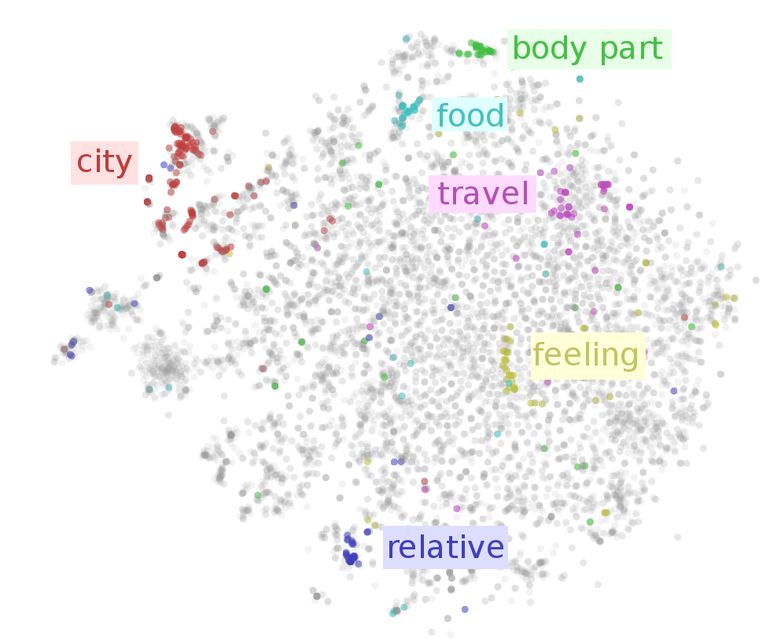
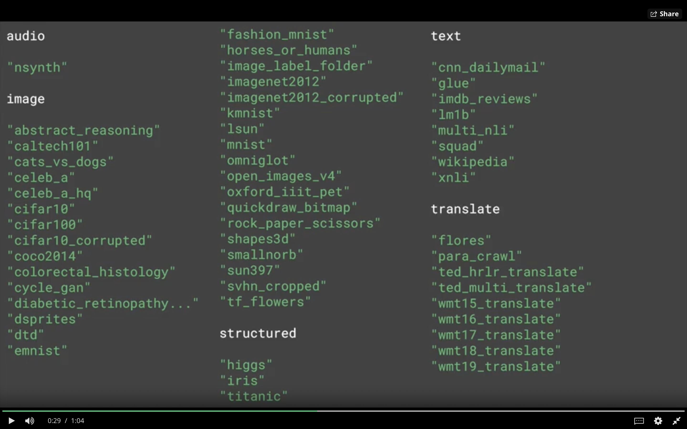
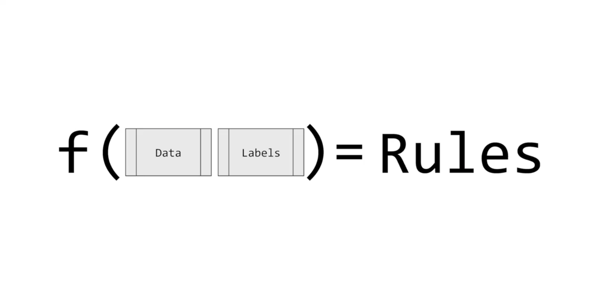
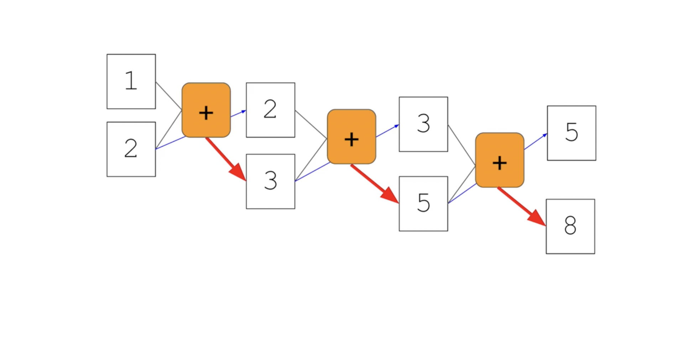
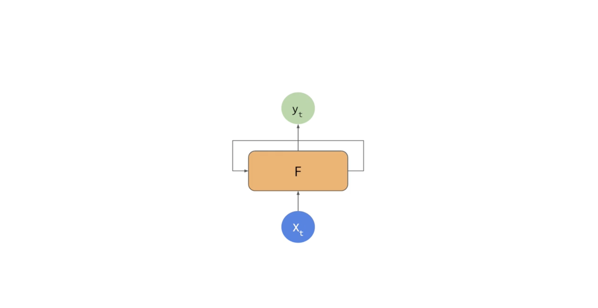
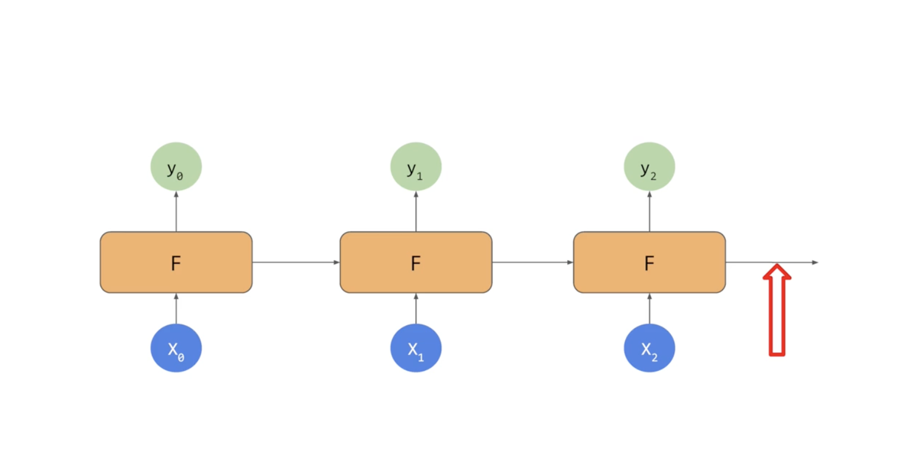
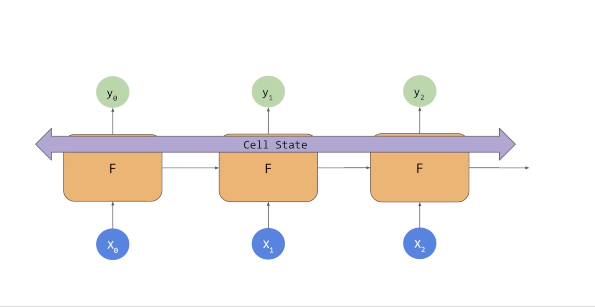

# [Natural Language Processing in TensorFlow](https://www.coursera.org/learn/natural-language-processing-tensorflow/home/welcome)

    - Week 1: How to convert the text into number representation, Tokenizer, fit_on_texts, texts_to_sequences, pad_sequences
    - Week 2: Word Embeddings - Classification problems
    - Week 3: Sequence models - RNN, LSTM, classification problems
    - Week 4: Sequence models and literature - text generation

- Week 1 - [Sentiment in text](#Sentiment-in-text)
- Week 2 - [Word Embeddings](#Word-Embeddings)
- Week 3 - [Sequence models](#Sequence-models)
- Week 4 - [Sequence models and literature](#Sequence-models-and-literature) 

## Sentiment in text
> [Week 1 Notebook](notebooks/Course_3_Week_1(Tokenizer-Sarcasm-Dataset).ipynb)

- How to load in the texts, pre-process it and set up your data so it can be fed to a neural network.
- https://rishabhmisra.github.io/publications/
- `Tokenizer` is used to tokenize the sentences, `oov_token=<Token>`can be used to encode unknown words
- `fit_on_texts(sentences)` is used to tokenize the list of sentences
    - Output: `{'<OOV>': 1, 'my': 2, 'love': 3, 'dog': 4, 'i': 5, 'you': 6, 'cat': 7, 'do': 8, 'think': 9, 'is': 10, 'amazing': 11}`
- `texts_to_sequences(sentences)` - the method to encode a list of sentences to use those tokens
    - Output: `[[5, 3, 2, 4], [5, 3, 2, 7], [6, 3, 2, 4], [8, 6, 9, 2, 4, 10, 11]]`

```py
tokenizer = Tokenizer(oov_token="<OOV>")
tokenizer.fit_on_texts(sentences)
word_index = tokenizer.word_index
sequences = tokenizer.texts_to_sequences(sentences)
padded = pad_sequences(sequences, padding='post') 
```

## Word Embeddings
> [Week 2 Model Training IMDB Reviews](notebooks/Course_3_Week_2(Model_Training_IMDB_Reviews).ipynb)

> [Week 2, beautiful code, Sarcasm Classifier](notebooks/Course_3_Week_2(Sarcasm-Classifier).ipynb)

> [Week 2, subwords](notebooks/Course_3_Week_2(Subwords).ipynb) - shows that Embeddings do not work with sequence of words 

<br>

- In the second week, we learn to prepare the data with Tokenizer API, and then teach our model
- TensorFlow Datasets: https://www.tensorflow.org/datasets
<br>
- https://github.com/tensorflow/datasets/tree/master/docs/catalog
- https://projector.tensorflow.org - to visualize the data

- **What is the purpose of the embedding dimension?**
> It is the number of dimensions for the **vector representing** the word encoding

- When tokenizing a corpus, what does the num_words=n parameter do?
> It specifies the maximum number of words to be tokenized, and picks the most common ‘n’ words

- NOTE: Sequence becomes much more important when dealing with subwords, but we’re ignoring word positions.

- It must specify 3 arguments, [reference](https://machinelearningmastery.com/use-word-embedding-layers-deep-learning-keras/):

    - **input_dim**: This is the size of the vocabulary in the text data. For example, if your data is integer encoded to values between 0-999, then the size of the vocabulary would be 1000 words. (all words)
    - **output_dim**: This is the size of the vector space in which words will be embedded. It defines the size of the output vectors from this layer for each word. For example, it could be 32 or 100 or even larger. Test different values for your problem.
    - **input_length**: This is the length of input sequences, as you would define for any input layer of a Keras model. For example, if all of your input documents are comprised of 100 words, this would be 100. (words in a sentence)

```py
def plot_graphs(history, string):
  plt.plot(history.history[string])
  plt.plot(history.history['val_'+string])

  plt.xlabel("Epochs")
  plt.ylabel(string)
  plt.legend([string, 'val_'+string])
  plt.show()
  
plot_graphs(history, "accuracy")
plot_graphs(history, "loss")
```

## Sequence models
> [Week 3 IMDB](notebooks/Course_3_Week_3(IMDB).ipynb) - RNN, Embedding, Conv 1D experimenting

> We looked first at Tokenizing words to get numeric values from them, and then using Embeddings to group words of similar meaning depending on how they were labelled. This gave you a good, but rough, sentiment analysis -- words such as 'fun' and 'entertaining' might show up in a positive movie review, and 'boring' and 'dull' might show up in a negative one. But sentiment can also be determined by the sequence in which words appear. For example, you could have 'not fun', which of course is the opposite of 'fun'. This week you'll start digging into a variety of model formats that are used in training models to understand context in sequence!

- We used **word embeddings** to sentiment words. But what if we can use RNN and LSTM to predict the group of words. We can analyse in which relative ordering the words are coming.

- <br>That's the classical ML, it doesn't take into account the sequences. For example, like **Fibonacci series**, we must know previous result to fit it into next input.

- <br>So, that's the idea behind RNN (recurrent neural network). The output of previous is the input to the next.

- <br> **LSTMs** have an additional pipeline of contexts called cell state. They can be bidirectional too.

- RNN, LSTM [video](https://www.youtube.com/watch?v=WCUNPb-5EYI)
- GRU - Gated recurrent union `tf.keras.layers.Bidirectional(tf.keras.layers.GRU(64)`

```python
"""LSTM in code"""
model = tf.keras.Sequential([
    tf.keras.layers.Embedding(tokenizer.vocab_size, 64),
    tf.keras.layers.Bidirectional(tf.keras.layers.LSTM(64), return_sequences=True), # You need to define `return_sequences=True` when stacking two LSTMs
    # tf.keras.layers.Bidirectional(tf.keras.layers.GRU(64)
    tf.keras.layers.Bidirectional(tf.keras.layers.LSTM(64)),
    tf.keras.layers.Dense(64, activation='relu'),
    tf.keras.layers.Dense(1, activation='sigmoid'),
])
```
```python
"""Using a convolutional network 1D"""
model = tf.keras.Sequential([
    tf.keras.layers.Embedding(tokenizer.vocab_size, 64),
    tf.keras.layers.Conv1D(128, 5, activation='relu'),
    tf.keras.layers.GlobalAveragePooling1D(),
    tf.keras.layers.Dense(64, activation='relu'),
    tf.keras.layers.Dense(1, activation='sigmoid')
])
```
```python
model = tf.keras.Sequential([
    tf.keras.layers.Embedding(vocab_size+1, embedding_dim, input_length=max_length), # weights=[embeddings_matrix], trainable=False
    tf.keras.layers.Dropout(0.2),
    tf.keras.layers.Conv1D(64, 5, activation='relu'),
    tf.keras.layers.MaxPooling1D(pool_size=4),
    tf.keras.layers.LSTM(64),
    tf.keras.layers.Dense(1, activation='sigmoid')
])
model.compile(loss='binary_crossentropy',optimizer='adam',metrics=['accuracy'])
model.summary()

num_epochs = 50
```

## Sequence models and literature
> **Text generation** 

> [Week 4 Sheckspire Text Generation](notebooks/Course_3_Week_4_Lesson_1_(Sheckspire_Text_Generation).ipynb)

> Wrap up from course: You’ve been experimenting with NLP for text classification over the last few weeks. Next week you’ll switch gears -- and take a look at using the tools that you’ve learned to predict text, which ultimately means you can create text. By learning sequences of words you can predict the most common word that comes next in the sequence, and thus, when starting from a new sequence of words you can create a model that builds on them. You’ll take different training sets -- like traditional Irish songs, or Shakespeare poetry, and learn how to create new sets of words using their embeddings!

- **Finding what the next word should be**

