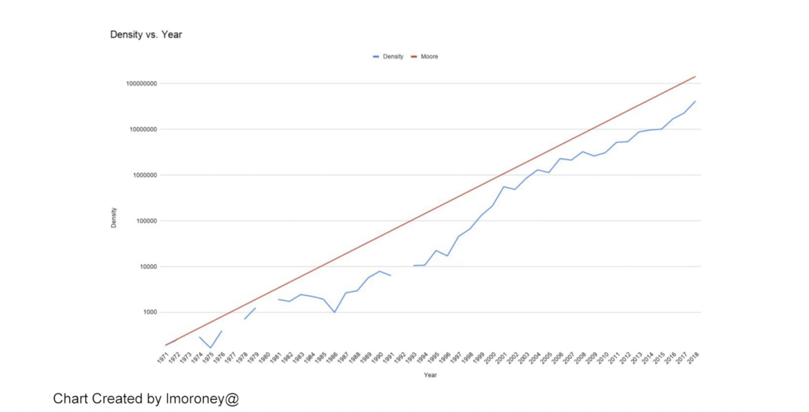
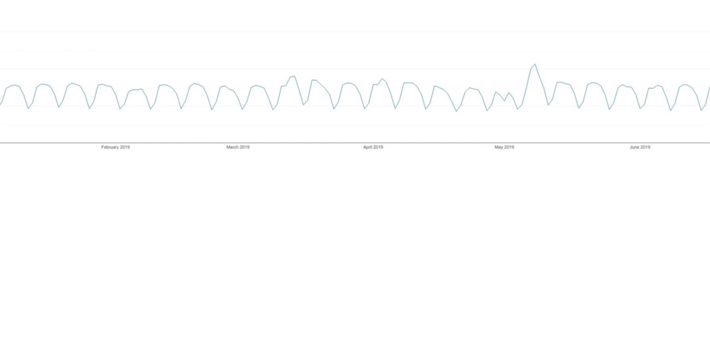
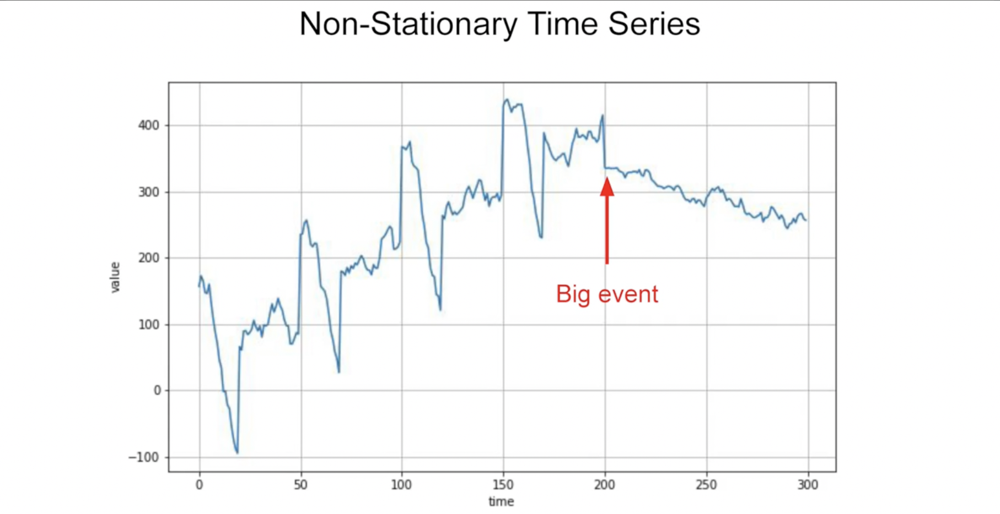
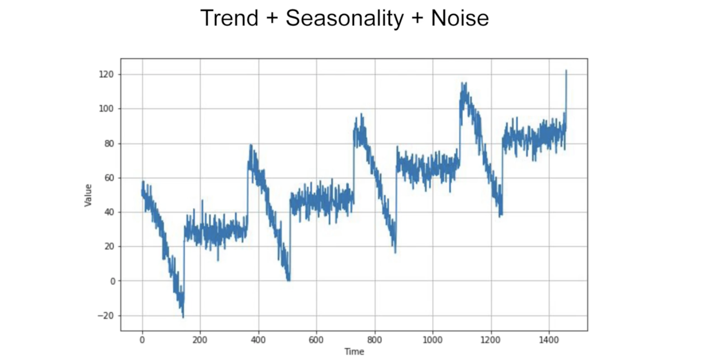
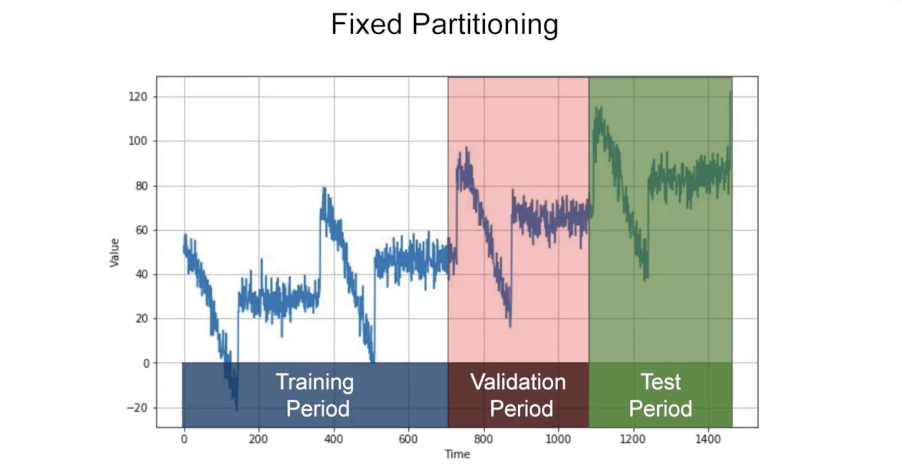
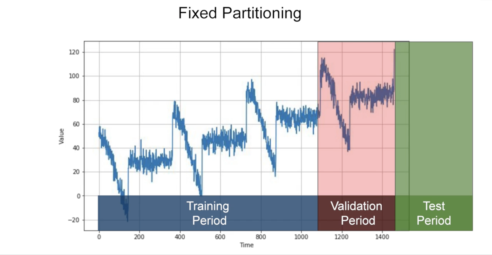
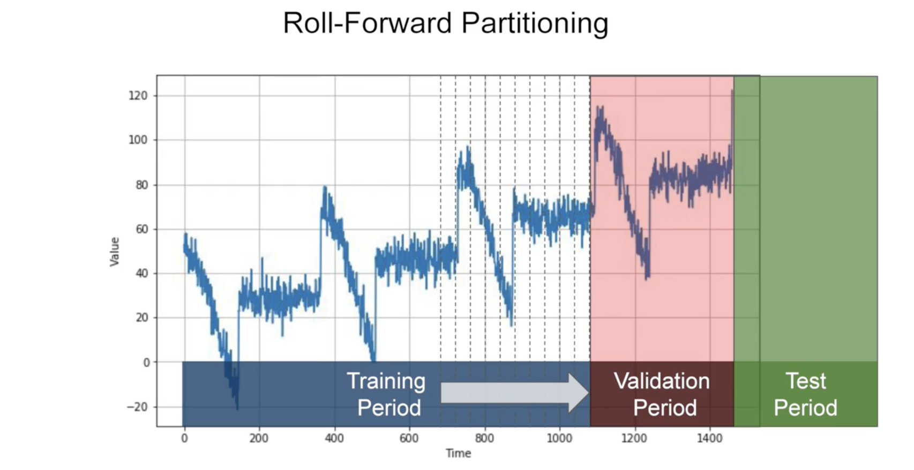
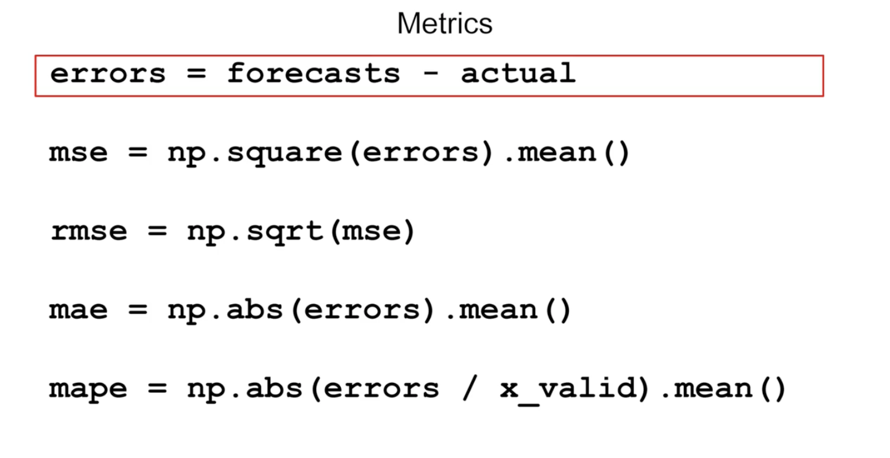

# [Sequences, Time Series and Prediction](https://www.coursera.org/learn/tensorflow-sequences-time-series-and-prediction)

    - Sequences and Prediction
    - Deep Neural Networks for Time Series
    - Recurrent Neural Networks for Time Series
    - Real-world time series data

## Sequences and Prediction
> Handling sequential time series data -- where values change over time, like the temperature on a particular day, stock prices, or the number of visitors to your web site.

> Predicting future values in these time series. We need to find the pattrn to predict new value.

- Time series can be used in Speech recognition

- Types:
    - **Trend** - upwords facing  
    - **Seasonality**  
    - Autocorrelation
    - Noise
    - Non-stationary time series  

- **Train, validation and test sets**
    - **Trend + Seasonality + Noise**  
    - **Naive forecasting** - take the last value, and assume that the next will be the same
    - **Fixed forecasting** - if data is seasonal you should include whole number of season (1, 2, 3 years. Then you have to train in Training period and evaluate of Val Period by tuning hyperparam. Then retrain of TP+VP and test of Test Period. Then again retrain with Test data too. 
    - We start with a short training period, and we gradually increase it, say by one day at a time, or by one week at a time. At each iteration, we train the model on a training period. And we use it to forecast the following day, or the following week, in the validation period. 

- **Metrics for evaluating performance**
    -  

## Deep Neural Networks for Time Series

## Recurrent Neural Networks for Time Series

## Real-world time series data
